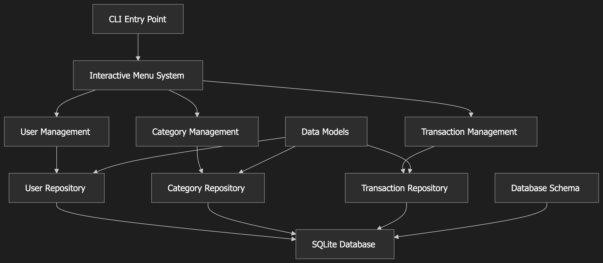

# Money Manager - Phase1 - CLI Application - Architecture Document

## Overview

This document outlines the architecture and implementation plan for the Money Manager CLI application.

## Architecture Diagram



## Key Design Decisions

### 1. Data Persistence
- **Choice**: SQLite database
- **Rationale**: Lightweight, serverless, no external dependencies, perfect for CLI applications
- **Configuration**: Database path configured via `MONEY_MANAGER_DB` environment variable
- **Initialization**: Database and tables created automatically on first run via `init_database()`

### 2. CLI Interface
- **Choice**: Simple `input()` prompts with interactive menus
- **Rationale**: Aligns with `.codebase` preference for minimal external libraries
- **User Experience**: Menu-driven navigation with clear options, validation, and screen clearing
- **Implementation**: `MoneyManagerCLI` class with dedicated menu methods for each entity

### 3. Architecture Pattern
- **Pattern**: Repository pattern for data access
- **Models**: Dataclasses for type safety and simplicity
- **Separation**: Clear separation between UI, business logic, and data access

### 4. Dependencies
- **External**: `python-dotenv` (for environment variable management)
- **Core Libraries**: `sqlite3`, `dataclasses`, `uuid`, `time`, `enum`, `typing`

## Project Structure

```
src/money_manager/
├── __init__.py          # Package initialization
├── cli.py              # Main entry point with interactive menus
├── models.py           # Data models (User, Category, Transaction, TransactionType)
├── database.py         # Database schema and initialization
├── repositories.py     # CRUD operations for all entities
└── utils.py           # Input validation and utility functions
```

## Data Models

Based on `design.md` specifications with implementation modifications:

### User Model
```python
@dataclass
class User:
    uid: str          # UUID as string
    name: str         # User's display name
```

### TransactionType Enum
```python
class TransactionType(Enum):
    INCOME = "income"
    EXPENSE = "expense"
```

### Category Model
```python
@dataclass
class Category:
    uid: str              # UUID as string
    name: str             # Category name
    type: TransactionType # Income or expense category
    
    def __str__(self) -> str:
        return f"{self.name} - {self.type.value}"
```

**Note**: The `parent_category` field from the original design was not implemented in Phase 1. Category hierarchy is deferred to future phases.

### Transaction Model
```python
@dataclass
class Transaction:
    uid: str          # UUID as string
    name: str         # Transaction description/name
    amount: float     # Transaction amount
    datetime: float   # Unix epoch timestamp
    user: User        # User object (not just ID)
    category: Category # Category object (not just ID)
    
    def __str__(self) -> str:
        date_str: str = epoch_to_datetime(epoch=self.datetime)
        return f"{self.name} - ${self.amount:.2f} - {self.user.name} - {self.category.name} - {self.category.type.value} ({date_str})"
```

**Key Changes from Design**:
- Added `name` field for transaction description
- Changed `date_time` to `datetime` (float/epoch timestamp instead of datetime object)
- Removed `type` field (derived from category.type)
- Changed `user_id` and `category` to full object references instead of just IDs

## Database Schema

### Tables Structure

```sql
-- Users table
CREATE TABLE users (
    uid TEXT PRIMARY KEY,
    name TEXT NOT NULL
);

-- Categories table (no parent_category in Phase 1)
CREATE TABLE categories (
    uid TEXT PRIMARY KEY,
    name TEXT NOT NULL,
    type TEXT NOT NULL CHECK (type IN ('income', 'expense'))
);

-- Transactions table with foreign keys
CREATE TABLE transactions (
    uid TEXT PRIMARY KEY,
    name TEXT NOT NULL,
    amount REAL NOT NULL,
    datetime REAL NOT NULL,  -- Unix epoch timestamp
    user_uid TEXT NOT NULL,
    category_uid TEXT NOT NULL,
    FOREIGN KEY (user_uid) REFERENCES users(uid),
    FOREIGN KEY (category_uid) REFERENCES categories(uid)
);
```

## Menu Structure

```
┌─ Main Menu ─────────────────────────────┐
│ 1. User Management                      │
│ 2. Category Management                  │
│ 3. Transaction Management               │
│ 4. Exit                                 │
└─────────────────────────────────────────┘
            │
            ├─ User Management ───────────┐
            │  │ 1. Create User           │
            │  │ 2. List Users            │
            │  │ 3. Update User           │
            │  │ 4. Delete User           │
            │  │ 5. Back to Main Menu     │
            │  └─────────────────────────┘
            │
            ├─ Category Management ───────┐
            │  │ 1. Create Category       │
            │  │ 2. List Categories       │
            │  │ 3. Update Category       │
            │  │ 4. Delete Category       │
            │  │ 5. Back to Main Menu     │
            │  └─────────────────────────┘
            │
            └─ Transaction Management ────┐
               │ 1. Create Transaction    │
               │ 2. List Transactions     │
               │ 3. Update Transaction    │
               │ 4. Delete Transaction    │
               │ 5. Back to Main Menu     │
               └─────────────────────────┘
```

## Implementation Guidelines

Following `.codebase` preferences:

### Code Style
- **Type hints**: All function signatures include type annotations
- **Minimal complexity**: Small, focused functions with single responsibilities
- **Early validation**: Input validation at function entry points
- **Simple style**: Readable code over clever implementations
- **No inline comments**: Code should be self-documenting
- **Minimal docstrings**: Only for public APIs

### Error Handling
- **Explicit exceptions**: Catch specific exceptions, not bare `except`
- **User-friendly messages**: Clear error messages for CLI users
- **Graceful degradation**: Handle database errors and invalid inputs

### Input Validation
Implemented in `utils.py`:
- **UUID validation**: `validate_uuid()` - Ensures proper UUID format
- **Amount validation**: `validate_positive_float()` - Positive numbers only
- **Date validation**: `datetime_to_epoch()` - Converts YYYY-MM-DD HH:MM format to epoch
- **Name validation**: `validate_non_empty()` - Non-empty strings
- **Date formatting**: `epoch_to_datetime()` - Converts epoch to readable format

## Repository Pattern Implementation

### Base Repository Interface
```python
class BaseRepository:
    def create(self, entity: T) -> str:  # Returns UUID
    def get_by_id(self, uid: str) -> T | None:
    def get_all(self) -> list[T]:
    def update(self, uid: str, **kwargs) -> bool:
    def delete(self, uid: str) -> bool:
```

### Specialized Repositories

#### UserRepository
- `create(user: User) -> str`: Create new user
- `get_by_id(uid: str) -> Optional[User]`: Get user by ID
- `get_all() -> list[User]`: Get all users
- `update(user: User) -> bool`: Update user
- `delete(uid: str) -> bool`: Delete user

#### CategoryRepository
- `create(category: Category) -> str`: Create new category
- `get_by_id(uid: str) -> Optional[Category]`: Get category by ID
- `get_all() -> list[Category]`: Get all categories
- `get_by_type(transaction_type: TransactionType) -> list[Category]`: Filter by type
- `update(category: Category) -> bool`: Update category
- `delete(uid: str) -> bool`: Delete category

#### TransactionRepository
- `create(transaction: Transaction) -> str`: Create new transaction
- `get_by_id(uid: str) -> Optional[Transaction]`: Get transaction by ID
- `get_all() -> list[Transaction]`: Get all transactions
- `get_by_user(user_uid: str) -> list[Transaction]`: Filter by user
- `get_by_user_and_type(user_uid: str, transaction_type: TransactionType) -> list[Transaction]`: Filter by user and type
- `update(transaction: Transaction) -> bool`: Update transaction
- `delete(uid: str) -> bool`: Delete transaction

**Note**: TransactionRepository internally uses UserRepository and CategoryRepository to resolve foreign key relationships and return complete objects.

## CLI Flow Examples

### Creating a User
```
==================================================
 Create User
==================================================

Enter user name: John Doe

✓ User created successfully with ID: 123e4567-e89b-12d3-a456-426614174000
Press Enter to continue...
```

### Adding a Transaction
```
==================================================
 Create Transaction
==================================================

Available items:
1. John Doe

Select user number: 1

Available items:
1. Food - expense
2. Transport - expense

Select category number: 1
Enter transaction name: Lunch
Enter transaction amount: 50.00

Enter date and time (YYYY-MM-DD HH:MM): 2025-01-15 12:30

✓ Transaction added successfully with ID: 789e0123-e89b-12d3-a456-426614174003
Press Enter to continue...
```

## Testing Strategy

While tests are marked as "on_request" in `.codebase`, the architecture supports easy testing:

- **Unit tests**: Individual repository methods
- **Integration tests**: Database operations with test database
- **CLI tests**: Menu navigation and input validation

**Current Test Files**:
- `tests/test_cli.py`: CLI functionality tests
- `tests/test_version.py`: Version verification tests

## Implementation Status

### ✅ Completed Features
- User CRUD operations (Create, Read, Update, Delete)
- Category CRUD operations with type filtering
- Transaction CRUD operations with full object relationships
- Interactive CLI with menu-driven navigation
- Input validation for all user inputs
- SQLite database with proper schema and foreign keys
- Environment-based database configuration
- Screen clearing and formatted output
- Confirmation prompts for delete operations

## Actual File Structure

```
src/money_manager/
├── __init__.py          # Package initialization
├── cli.py              # MoneyManagerCLI class with all menu implementations (486 lines)
├── models.py           # User, Category, Transaction, TransactionType (42 lines)
├── database.py         # Database initialization and connection management (60 lines)
├── repositories.py     # UserRepository, CategoryRepository, TransactionRepository (264 lines)
└── utils.py           # Validation and utility functions (59 lines)

tests/
├── __init__.py
├── test_cli.py         # CLI tests
└── test_version.py     # Version tests
```

## Key Implementation Details

### Environment Configuration
- Database path configured via `MONEY_MANAGER_DB` environment variable
- Uses `python-dotenv` to load `.env` file
- Validates parent directory exists before creating database

### CLI Architecture
- Single `MoneyManagerCLI` class manages all interactions
- Helper methods for common operations:
  - `_display_menu()`: Shows menu and gets user choice
  - `_select_item_from_list()`: Generic item selection from list
  - `_get_transaction_type()`: Transaction type selection
  - `_get_validated_name()`: Name input with validation
  - `_get_validated_amount()`: Amount input with validation
- Separate menu methods for each entity type
- Consistent error handling and user feedback

### Data Flow
1. User interacts with CLI menus
2. CLI validates input using `utils.py` functions
3. CLI creates model objects from validated input
4. Repository methods handle database operations
5. Results displayed to user with success/error messages

## File Dependencies

This architecture document references:
- `design.md` - Original requirements specification
- `.codebase` - Development preferences and guidelines
- `pyproject.toml` - Project configuration
- All source files in `src/money_manager/`